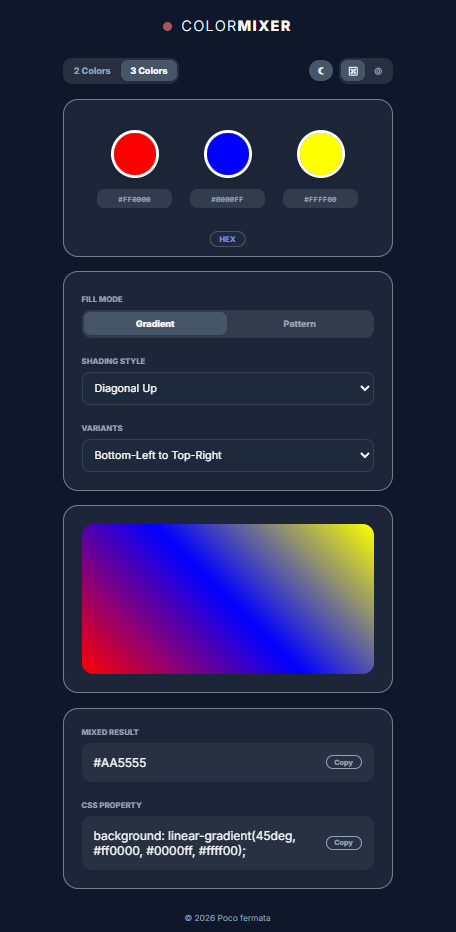

# Color Mixer 🎨
A minimalist, web-based color mixing tool designed for designers and developers to create beautiful gradients and patterns with ease.

---

## ✨ About

This app was created as a follow-up to my previous project:  
[Color Picker App](https://makutosi.github.io/color-picker-app/)

After reading a blog post, I came up with the idea for this app.  
The article described the opening ceremony of the Milano Cortina 2026 Winter Olympics, featuring three giant paint tubes under the concept of **“ARMONIA” (harmony)**, and the idea that the three primary colors (red, blue, yellow) can create an infinite range of colors.  

It also included a watercolor painting made using only these three colors, depicting the artist’s cat seeing snow for the first time, which left a strong impression on me.  

Along with inspiration from the Excel art of **Masako Wakamiya**, I created this app to explore color harmony, including 3-color gradients and patterns.

---

## 💻 Screenshot
<p align="center">
  
</p>

---

## 🚀 Live Demo & 🎉 Enjoy!
Try the app here: [Color Mixer](https://makutosi.github.io/color-mixer/)

Play with colors, mix gradients and patterns, and enjoy discovering new combinations! ✨

---

## ✨ Features

* **Dual/Triple Color Mixing**: Support for 2 or 3 color palettes.
* **Intelligent Randomization**:
  * **Chaos Mode**: Purely random colors.
  * **Harmonic Mode**: Based on color theory (Golden Ratio) for aesthetic results.
* **Gradients & Patterns**: Switch between smooth CSS gradients and various CSS patterns (Dots, Grid, Waves, etc.).
* **Interactive UI**: Drag-and-drop to reorder colors and instantly see the result.
* **Developer Friendly**: One-click copy for Hex/RGB values and CSS background properties.
* **Dark Mode**: Fully themed for comfortable night-time usage.
* **Dynamic Favicon**: The browser tab icon changes to your mixed color in real-time.

---

### 🎯 Output
* Copy:
  - Mixed color result
  - CSS property

Example usage (try in CodePen or JSFiddle):

```html
<div class="box"></div>
```
```css
.box {
  width: 100vw;
  height: 100vh;
  background: linear-gradient(#d74257 1px, transparent 1px),
              linear-gradient(90deg, #d74257 1px, transparent 1px),
              #4282d7;
  background-size: 20px 20px;
}
```

---

## 🛠️ Tech Stack
- HTML5 – structure
- CSS3 – styling (Flexbox, Glassmorphism)
- JavaScript (ES6+) – logic & interactions

## 📝 License
This project is open-source and available under the [MIT License](LICENSE).
